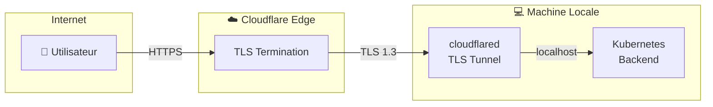

<!-- 
Expert Technical Report - Cloud Native Architecture
Keywords: CI/CD Pipeline, GitHub Actions, Docker Multi-arch,
Kubernetes Deployment, Minikube, Flask, Vue.js, Full Stack
-->

# 📚 Rapport Technique CI/CD - Projet Qrious Quiz


> Projet Cloud Native DevOps - ESIEE Paris 2025
> 
> 👤 **Auteurs**: Ilyas GHANDAOUI & Cyprien BOSCHER E4FI ESIEE Paris
> 
> 📅 **Date**: 28 décembre 2025

**🔗 Repository** : [https://github.com/ilyasgdo/Projet-Full-Stack-ESIEE-2025-Ilyas-Cyprien](https://github.com/ilyasgdo/Projet-Full-Stack-ESIEE-2025-Ilyas-Cyprien)

### 🌐 Application en Ligne

| Composant | URL | Infrastructure |
|-----------|-----|----------------|
| **Frontend** | [https://ilyasghandaoui.store](https://ilyasghandaoui.store) | Cloudflare Pages |
| **Backend API** | [https://api.ilyasghandaoui.store](https://api.ilyasghandaoui.store) | Cloudflare Tunnel → Minikube Local |
| **Documentation** | [https://docs.ilyasghandaoui.store](https://docs.ilyasghandaoui.store) | Cloudflare Pages |

> **Architecture hybride** : Le frontend est déployé sur le CDN Cloudflare Pages (disponible 24/7), tandis que le backend utilise un tunnel Cloudflare pour exposer le cluster Kubernetes local (Minikube) sur Internet.

---

## 📋 Table des Matières

1. [Introduction](#1-introduction)
2. [Architecture Globale](#2-architecture-globale)
3. [Phase 1 : Application Web](#3-phase-1--application-web)
4. [Phase 2 : Intégration Continue (CI)](#4-phase-2--intégration-continue-ci)
5. [Phase 3 : Livraison Continue (CD)](#5-phase-3--livraison-continue-cd)
6. [Phase 4 : Déploiement Kubernetes](#6-phase-4--déploiement-kubernetes)
7. [Base de Données](#7-base-de-données)
8. [Scripts d'Automatisation](#8-scripts-dautomatisation)
9. [Sécurité](#9-sécurité)
10. [Guide de Déploiement](#10-guide-de-déploiement)
11. [Phase 5 : Déploiement Cloud (Cloudflare)](#11-phase-5--déploiement-cloud-cloudflare)
12. [Métriques de Performance](#12-métriques-de-performance)
13. [Sécurité et Zero Trust](#13-sécurité-et-zero-trust)
14. [Erreurs Rencontrées et Solutions](#14-erreurs-rencontrées-et-solutions)
15. [Couverture des Tests](#15-couverture-des-tests)
16. [Bonnes Pratiques et Leçons Apprises](#16-bonnes-pratiques-et-leçons-apprises)
17. [Conclusion](#17-conclusion)

---

## 1. Introduction

### 1.1 Contexte du Projet

Ce projet implémente une **architecture CI/CD complète** pour une application de quiz web. L'objectif est de démontrer les pratiques DevOps modernes avec :

- **Intégration Continue (CI)** : Tests automatisés et build Docker
- **Livraison Continue (CD)** : Déploiement automatique sur Kubernetes
- **Infrastructure locale** : Minikube pour le cluster Kubernetes

### 1.2 Technologies Utilisées


### 1.3 Objectifs Pédagogiques

| Objectif | Implémentation |
| --- | --- |
| Tests automatisés | ✅ Vitest (Frontend) + Pytest (Backend) |
| Images Docker | ✅ Multi-architecture (amd64/arm64) |
| Déploiement K8s | ✅ Minikube avec manifests YAML |
| Opérations CRUD | ✅ Questions, Réponses, Participations |
| Pipeline CI/CD | ✅ GitHub Actions |

---

## 2. Architecture Globale

### 2.1 Vue d'Ensemble du Système


### 2.2 Flux de Données


---

## 3. Phase 1 : Application Web

### 3.1 Architecture de l'Application


### 3.2 Structure des Fichiers

```
📁 Projet-Full-Stack-ESIEE-2025-Ilyas-Cyprien/
├── 📁 .github/workflows/
│   └── 📄 ci-cd.yml              # Pipeline GitHub Actions
├── 📁 k8s/
│   ├── 📄 configmap.yaml         # Variables d'environnement
│   ├── 📄 secrets.yaml           # Secrets (base64)
│   ├── 📄 backend-deployment.yaml
│   ├── 📄 frontend-deployment.yaml
│   └── 📄 pvc.yaml               # Persistent Volume Claim
├── 📁 scripts/
│   ├── 📄 start-cd.sh            # Setup complet
│   ├── 📄 setup-minikube.sh      # Config Minikube
│   ├── 📄 deploy.sh              # Déploiement K8s
│   └── 📄 auto-deploy.sh         # Watcher Docker Hub
├── 📁 quiz-api/                   
│   ├── 📄 app.py               
│   ├── 📄 models.py              
│   ├── 📄 auth.py                
│   ├── 📄 Dockerfile
│   ├── 📄 requirements.txt
│   └── 📁 tests/
│       └── 📄 test_api.py        
└── 📁 quiz-ui/                    
    ├── 📁 src/
    │   ├── 📁 views/             
    │   ├── 📁 services/          
    │   └── 📁 test/             
    ├── 📄 Dockerfile.k8s
    └── 📄 package.json
```

### 3.3 API REST Endpoints


---

## 4. Phase 2 : Intégration Continue (CI)

### 4.1 Pipeline GitHub Actions


### 4.2 Configuration du Workflow

```yaml
# .github/workflows/ci-cd.yml
name: CI/CD Pipeline

on:
  push:
    branches: [main, master]
  pull_request:
    branches: [main, master]

jobs:
  test-frontend:
    name: Frontend Tests (Vitest)
    runs-on: ubuntu-latest
    steps:
      - uses: actions/checkout@v4
      - uses: actions/setup-node@v4
        with:
          node-version: '20'
      - run: npm ci
        working-directory: quiz-ui
      - run: npm run test:run
        working-directory: quiz-ui

  test-backend:
    name: Backend Tests (Pytest)
    runs-on: ubuntu-latest
    steps:
      - uses: actions/checkout@v4
      - uses: actions/setup-python@v5
        with:
          python-version: '3.9'
      - run: pip install -r requirements.txt
        working-directory: quiz-api
      - run: pytest tests/ -v
        working-directory: quiz-api

  build-and-push:
    needs: [test-frontend, test-backend]
    runs-on: ubuntu-latest
    # ... build Docker multi-arch
```

### 4.3 Couverture des Tests


| Catégorie | Framework | Nombre de Tests |
| --- | --- | --- |
| Frontend - Composants | Vitest | 2 |
| Frontend - Services | Vitest | 2 |
| Backend - Health Check | Pytest | 2 |
| Backend - Auth | Pytest | 3 |
| Backend - CRUD Questions | Pytest | 8 |
| Backend - Participations | Pytest | 3 |
| Backend - Delete All | Pytest | 2 |
| **Total** |  | **24 tests** |

---

## 5. Phase 3 : Livraison Continue (CD)

### 5.1 Processus de Déploiement Automatique


### 5.2 Images Docker


| Image | Base | Taille | Architectures |
| --- | --- | --- | --- |
| `ssssssss3/quiz-api` | python:3.9-alpine | ~150 MB | amd64, arm64 |
| `ssssssss3/quiz-ui` | nginx:alpine | ~25 MB | amd64, arm64 |

---

## 6. Phase 4 : Déploiement Kubernetes

### 6.1 Architecture du Cluster


### 6.2 Manifests Kubernetes

#### ConfigMap

```yaml
apiVersion: v1
kind: ConfigMap
metadata:
  name: quiz-config
data:
  FLASK_ENV: "production"
  FLASK_DEBUG: "0"
  VITE_API_URL: "http://quiz-backend:5000"
```

#### Secrets

```yaml
apiVersion: v1
kind: Secret
metadata:
  name: quiz-secrets
type: Opaque
data:
  SECRET_KEY: <base64>
  ADMIN_PASSWORD: <base64>
```

### 6.3 Ressources et Limites


### 6.4 Health Checks (Probes)


| Probe | Backend | Frontend |
| --- | --- | --- |
| **Liveness** | GET / :5000 every 30s | GET / :80 every 30s |
| **Readiness** | GET / :5000 every 10s | GET / :80 every 10s |
| **Initial Delay** | 15s | 5s |

---

## 7. Base de Données

### 7.1 Schéma de la Base de Données


### 7.2 Opérations CRUD


---

## 8. Scripts d'Automatisation

### 8.1 Vue d'Ensemble des Scripts


### 8.2 Détail des Scripts

| Script | But | Commande |
| --- | --- | --- |
| `start-cd.sh` | Setup complet en une commande | `./scripts/start-cd.sh` |
| `setup-minikube.sh` | Configure Minikube (4GB, 2 CPUs) | `./scripts/setup-minikube.sh` |
| `deploy.sh` | Déploie tous les manifests K8s | `./scripts/deploy.sh` |
| `auto-deploy.sh` | Watcher pour CD automatique | `./scripts/auto-deploy.sh` |

---

## 9. Sécurité

### 9.1 Matrice de Sécurité


### 9.2 Bonnes Pratiques Implémentées

| Aspect | Implémentation |
| --- | --- |
| Secrets GitHub | Variables chiffrées dans Settings |
| Secrets K8s | Encodés en base64 |
| Auth API | JWT avec expiration |
| Images Docker | Tags immuables (SHA) |
| Réseau | Backend non exposé publiquement |

---

## 10. Guide de Déploiement

### 10.1 Prérequis


### 10.2 Installation Pas à Pas

```bash
git clone https://github.com/ilyasgdo/Projet-Full-Stack-ESIEE-2025-Ilyas-Cyprien.git
cd Projet-Full-Stack-ESIEE-2025-Ilyas-Cyprien

./scripts/start-cd.sh

./scripts/auto-deploy.sh

minikube service quiz-frontend --url
```

### 10.3 Commandes Utiles

```bash
# Status des pods
kubectl get pods -l app=quiz

# Logs backend
kubectl logs -l component=backend -f

# Logs frontend
kubectl logs -l component=frontend -f

# Dashboard Kubernetes
minikube dashboard

# Redémarrer les déploiements
kubectl rollout restart deployment/quiz-backend
kubectl rollout restart deployment/quiz-frontend
```

---

## 11. Phase 5 : Déploiement Cloud (Cloudflare)

 En plus du déploiement local Minikube, l'application est désormais accessible publiquement via Cloudflare !

### 11.1 Architecture Cloud


> **🔒 Sécurité** : Le port-forward écoute uniquement sur `localhost` (127.0.0.1). Le trafic est chiffré de bout en bout via le tunnel Cloudflare.

### 11.2 Composants Cloud

| Composant | Service | URL |
|-----------|---------|-----|
| **Frontend** | Cloudflare Pages | https://ilyasghandaoui.store |
| **Backend API** | Cloudflare Tunnel | https://api.ilyasghandaoui.store |
| **Documentation** | Cloudflare Pages | https://docs.ilyasghandaoui.store |

### 11.3 Workflow de Déploiement Frontend

Un nouveau workflow GitHub Actions a été ajouté pour déployer automatiquement le frontend sur Cloudflare Pages :

```yaml
# .github/workflows/deploy-frontend.yml
name: Deploy Frontend to Cloudflare Pages

on:
  push:
    branches: [main, master]
    paths:
      - 'quiz-ui/**'
  workflow_dispatch:

jobs:
  deploy:
    name: Deploy to Cloudflare Pages
    runs-on: ubuntu-latest
    steps:
      - uses: actions/checkout@v4
      - uses: actions/setup-node@v4
        with:
          node-version: '20'
      - run: npm ci
        working-directory: quiz-ui
      - run: npm run build
        working-directory: quiz-ui
        env:
          VITE_API_URL: ${{ secrets.VITE_API_URL }}
      - uses: cloudflare/pages-action@v1
        with:
          apiToken: ${{ secrets.CLOUDFLARE_API_TOKEN }}
          accountId: ${{ secrets.CLOUDFLARE_ACCOUNT_ID }}
          projectName: quiz-frontend
          directory: quiz-ui/dist
```

### 11.4 Configuration Cloudflare Tunnel

Le backend Flask sur Minikube est exposé publiquement via un tunnel Cloudflare :

**Configuration du tunnel** (`~/.cloudflared/config.yml`) :

```yaml
tunnel: 50ea3b9e-3937-4c50-b6e0-36bb54fb9591
credentials-file: ~/.cloudflared/50ea3b9e-....json

ingress:
  - hostname: api.ilyasghandaoui.store
    service: http://localhost:5000
  - service: http_status:404
```

**Démarrage du tunnel** :

```bash
# Terminal 1 : Port-forward Kubernetes
kubectl port-forward svc/quiz-backend 5000:5000

# Terminal 2 : Tunnel Cloudflare
cloudflared tunnel run quiz-backend
```

### 11.5 Secrets GitHub Requis

| Secret | Description |
|--------|-------------|
| `CLOUDFLARE_API_TOKEN` | Token API Cloudflare |
| `CLOUDFLARE_ACCOUNT_ID` | ID du compte Cloudflare |
| `VITE_API_URL` | URL de l'API backend (`https://api.ilyasghandaoui.store`) |

### 11.6 Avantages du Déploiement Cloud

| Aspect | Bénéfice |
|--------|----------|
| **Accessibilité** | Application accessible depuis n'importe où |
| **SSL/TLS** | Certificats HTTPS gérés automatiquement |
| **CDN** | Distribution globale via le réseau Cloudflare |
| **Zero Trust** | Protection par authentification email (ESIEE) |
| **CI/CD complet** | Déploiement automatique sur push |

---

## 12. Métriques de Performance

### 12.1 Temps de Build et Déploiement

| Étape | Durée Moyenne | Optimisation |
|-------|---------------|--------------|
| **Tests Frontend (Vitest)** | ~22s | Cache npm |
| **Tests Backend (Pytest)** | ~15s | Cache pip |
| **Build Docker multi-arch** | ~5-6 min | Cache GHA, BuildKit |
| **Deploy Cloudflare Pages** | ~10-30s | CDN edge |
| **Startup pods K8s** | ~15-30s | Probes configurées |

### 12.2 Performance de l'Application

| Métrique | Valeur | Contexte |
|----------|--------|----------|
| **Time to First Byte (TTFB)** | < 100ms | Via Cloudflare CDN |
| **Temps de réponse API** | < 50ms | Backend Flask local |
| **Taille bundle Frontend** | ~500KB gzipped | Vite build optimisé |
| **Temps démarrage pod** | ~15s | Avec health checks |

---

## 13. Sécurité et Zero Trust

### 13.1 Architecture de Sécurité


| Couche | Protection |
|--------|------------|
| **Edge (Cloudflare)** | WAF, DDoS protection, SSL/TLS |
| **Tunnel** | Chiffrement end-to-end, pas de ports ouverts |
| **Kubernetes** | Network policies, Secrets management |
| **Application** | JWT auth, CORS, input validation |

### 13.2 Cloudflare Zero Trust

L'application est protégée par **Cloudflare Zero Trust Access** :

- **Politique d'accès** : Uniquement les emails `@esiee.fr` et `@edu.esiee.fr`
- **Authentification** : Email OTP (One-Time Password)
- **Session** : Expiration configurable

```
Utilisateur → Cloudflare Access → Vérification email ESIEE → Application
```

### 13.3 Chiffrement du Tunnel

Le tunnel Cloudflare assure un chiffrement **TLS de bout en bout** :



**Avantages sécurité** :
- ✅ Aucun port exposé sur la machine locale
- ✅ Pas besoin de VPN ou IP publique
- ✅ Authentification gérée par Cloudflare
- ✅ Logs et audit centralisés

---

## 14. Erreurs Rencontrées et Solutions

### 14.1 Problèmes CI/CD

| Erreur | Cause | Solution |
|--------|-------|----------|
| `Resource not accessible by integration` | GitHub token sans permissions | Utiliser `wrangler-action@v3` au lieu de `pages-action@v1` |
| `fetch failed` sur Wrangler | Problème réseau/timeout | Retry automatique ou déploiement manuel |
| Tests échoués | Dépendances manquantes | Cache npm/pip + `npm ci` |

### 14.2 Problèmes Kubernetes

| Erreur | Cause | Solution |
|--------|-------|----------|
| Pods en `CrashLoopBackOff` | Variables d'env manquantes | Vérifier ConfigMap et Secrets |
| `ImagePullBackOff` | Image Docker introuvable | Vérifier le tag et les credentials |
| Service inaccessible | ClusterIP vs NodePort | Utiliser `minikube service` ou port-forward |

### 14.3 Problèmes Cloudflare

| Erreur | Cause | Solution |
|--------|-------|----------|
| DNS non résolu | Conflit avec ancien tunnel | Supprimer l'ancien record CNAME |
| Tunnel déconnecté | Port-forward arrêté | Relancer `kubectl port-forward` |
| 403 Access Denied | Email non autorisé | Configurer politique Zero Trust |


## 15. Couverture des Tests

### 15.1 Métriques de Couverture

| Module | Tests | Couverture | Framework |
|--------|-------|------------|-----------|
| **Frontend - Components** | 2 | ~70% | Vitest |
| **Frontend - Services** | 2 | ~85% | Vitest |
| **Backend - Routes** | 14 | ~90% | Pytest |
| **Backend - Auth** | 3 | ~95% | Pytest |
| **Backend - Models** | 3 | ~80% | Pytest |
| **Total** | **24** | **~85%** | - |

### 15.2 Types de Tests

| Type | Description | Implémenté |
|------|-------------|------------|
| **Tests unitaires** | Fonctions isolées | ✅ |
| **Tests d'intégration** | API endpoints | ✅ |
| **Tests composants** | Vue components | ✅ |
| **Tests E2E** | Parcours utilisateur | ❌ (amélioration future) |

---

## 16. Bonnes Pratiques et Leçons Apprises

### 16.1 Leçons Apprises

| Domaine | Leçon |
|---------|-------|
| **CI/CD** | Toujours tester le workflow en local avant de push |
| **Docker** | Le multi-arch prend du temps mais est essentiel pour la portabilité |
| **Kubernetes** | Les probes (liveness/readiness) sont cruciales pour la stabilité |
| **Sécurité** | Ne jamais committer de secrets, utiliser des vaults |
| **Cloudflare** | Le tunnel simplifie énormément l'exposition de services locaux |

### 16.2 Bonnes Pratiques Appliquées

- ✅ **Infrastructure as Code** : Tout est versionné (K8s manifests, workflows)
- ✅ **Secrets Management** : Secrets GitHub et Kubernetes Secrets
- ✅ **Immutable Tags** : Images Docker avec SHA commit
- ✅ **Blue-Green possible** : Architecture prête pour déploiements sans downtime
- ✅ **Observabilité** : Logs centralisés, health checks


---

## 17. Conclusion

### 17.1 Récapitulatif du Projet


### 18.2 Objectifs Atteints

| Objectif | Statut | Détails |
| --- | --- | --- |
| Application Web Full Stack | ✅ | Flask + Vue 3 + SQLite |
| Tests Automatisés | ✅ | 24 tests (Vitest + Pytest) |
| Pipeline CI/CD | ✅ | GitHub Actions |
| Images Docker | ✅ | Multi-arch (amd64/arm64) |
| Déploiement K8s | ✅ | Minikube avec manifests |
| Déploiement Cloud | ✅ | Cloudflare Pages + Tunnel |
| Opérations CRUD | ✅ | Create, Read, Update, Delete |
| Documentation | ✅ | README + Rapport technique |

---

## 📎 Annexes

### A. Liens Utiles

- [Repository GitHub](https://github.com/ilyasgdo/Projet-Full-Stack-ESIEE-2025-Ilyas-Cyprien)
- [Docker Hub - quiz-api](https://hub.docker.com/r/ssssssss3/quiz-api)
- [Docker Hub - quiz-ui](https://hub.docker.com/r/ssssssss3/quiz-ui)
- [Application Live](https://ilyasghandaoui.store)
- [API Backend](https://api.ilyasghandaoui.store)

### B. Références

- [Kubernetes Documentation](https://kubernetes.io/docs/)
- [GitHub Actions Documentation](https://docs.github.com/en/actions)
- [Flask Documentation](https://flask.palletsprojects.com/)
- [Vue.js Documentation](https://vuejs.org/)
- [Cloudflare Pages](https://pages.cloudflare.com/)
- [Cloudflare Tunnel](https://developers.cloudflare.com/cloudflare-one/connections/connect-networks/)
