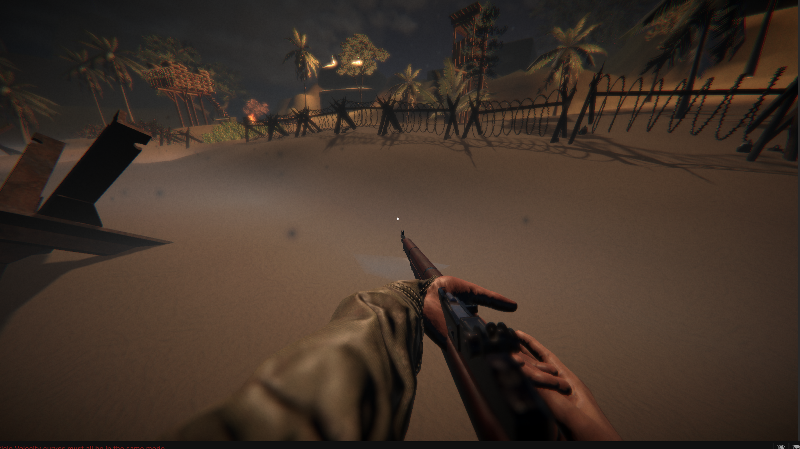
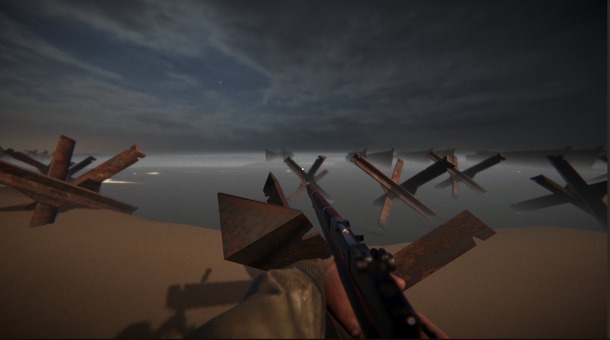

## 2. Milieux Volumétriques Hétérogènes

La simulation atmosphérique ("Tempête de Sable" et "Brouillard") adopte une approche hybride et **GPU-Driven**.

### Tempête de Sable et Éclairage 6-Axes
Plutôt que des *billboards* simples, le shader de particules implémente une approximation d'**Éclairage 6-Axes (6-Way Lighting)**.
*   L'irradiance est échantillonnée depuis six directions cardinales.
*   Mélange selon la fonction de phase pour approximer la diffusion de Mie des grains de sable.

### Brouillard Volumétrique
Le système de brouillard utilise une **Scriptable Renderer Feature** (`VolumetricFogFeature.cs`) injectée avant les transparents.
*   **Raymarching** : Exécuté en espace écran.
*   **Fonction de Densité** : $\rho(h) = \text{Density} \times e^{-(h - \text{FogHeight}) \times \text{Falloff}}$ (Décroissance exponentielle avec la hauteur).
*   **Reprojection Temporelle** : Utilisation de textures de bruit 3D (Perlin-Worley) avec advection pour simuler la turbulence.

