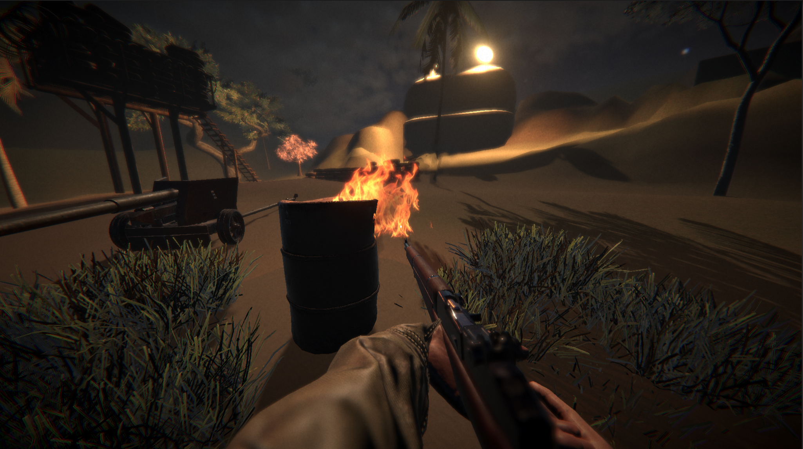

## 4. Post-Traitement & Effets Caméra

### Distorsion Thermique (Heat Haze)
Les flammes génèrent des particules de distorsion invisibles qui affectent le rendu final via un shader de réfraction personnalisé.
*   **Approche** : Masque de distance radial procédural.
*   **Intérêt** : Évite un post-process plein écran coûteux en localisant l'effet sur les foyers.

### Convolution Anamorphique
*   **Lens Flares** : Sprites procéduraux agissant comme noyaux de convolution pour les pixels à haute luminance.
*   **Occlusion** : Gestion de la latence pour l'estompage progressif.
