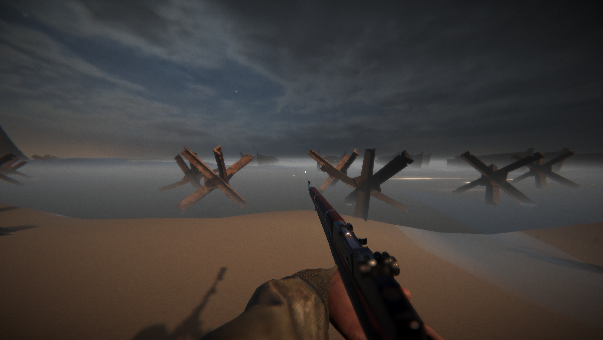
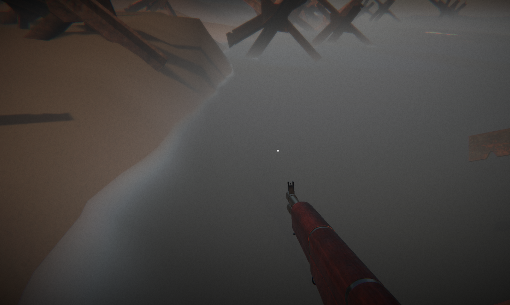
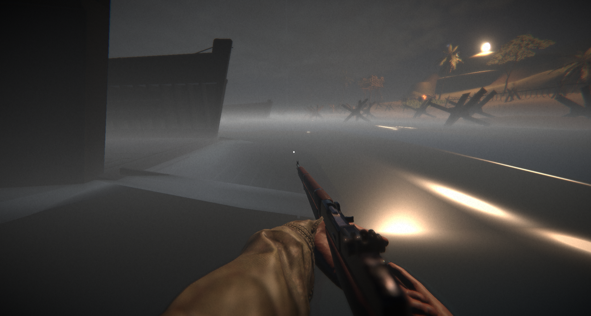

## 3. Synthèse de Surface Hydrodynamique

Le rendu de l'eau repose sur la **Sommation d'Ondes Trochoïdales de Gerstner** (Compute Shader `WaterSimulation.compute`).

*   **Déplacement de Vertex** : Somme d'octaves d'ondes sur le GPU.
    

*   **Shore Masking** : Modulation de l'amplitude via une texture de masque (`RFloat`) pour éviter le clipping avec le terrain et les quais.
    
*   **Shading** : BRDF GGX pour le spéculaire, approximation de Fresnel (Schlick) et réfraction via l'*Opaque Texture*.
    

